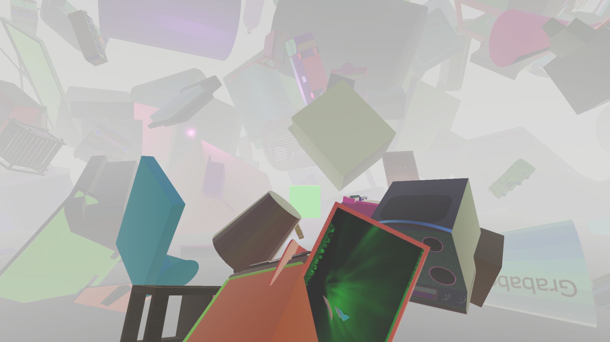
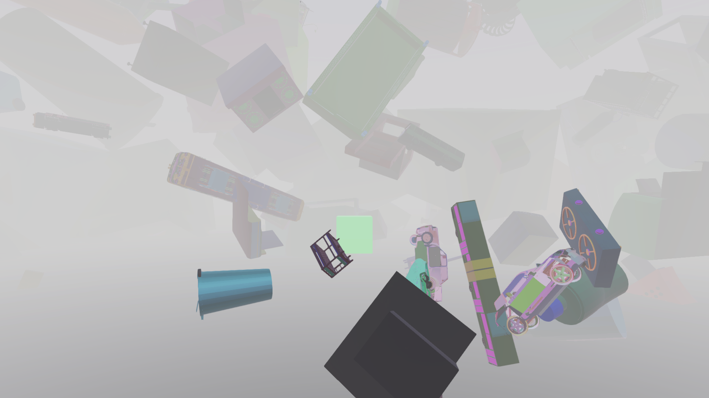
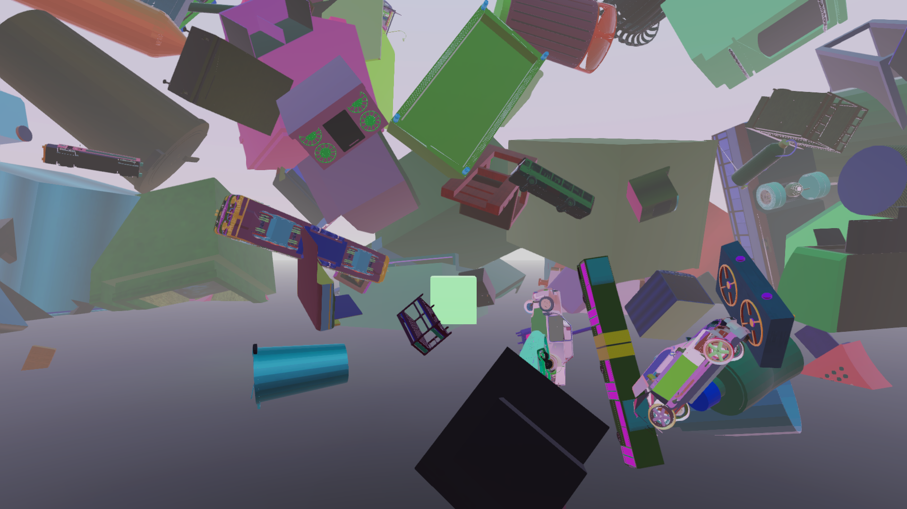

## Dataset Generation

In this project we focused on engineering the data such that it gives the optimal dehazing performance when trained upon. *Unity 2020.2.0f1* was used to generate data, this process was automated using the scripting language C# to produce data that lie in a predefined boundary. 

## Resources

* 3D models from [ShapeNet](https://shapenet.org/).

### Files

*  `MasterGenerator` - Brains of this process, randomizes different aspects of the environment to produce data.
*  `RenderDepth`(Not operational) - Renders a depth map of the scene.
*  `SpawnGizmos` - In debugging mode gives an overview of the regions of the environment data is going to be generated in.

HDRP pipeline's volumetric fog was used during the generation to vary haze.

### Samples from Dataset

 

 

