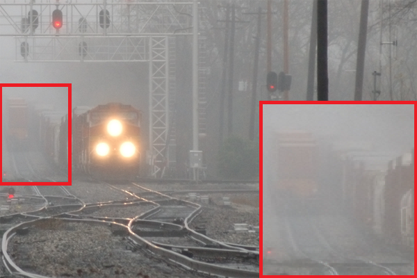
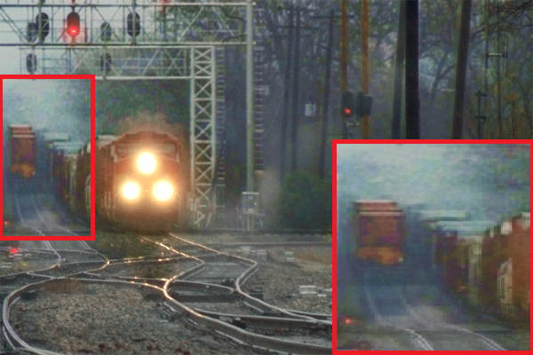
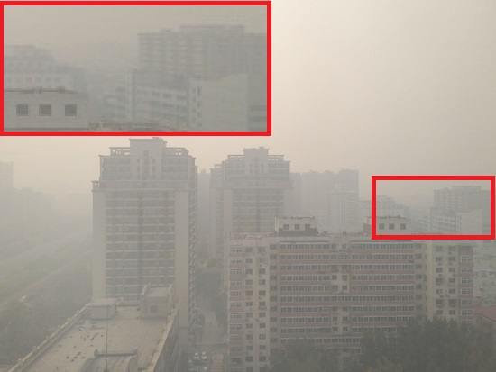
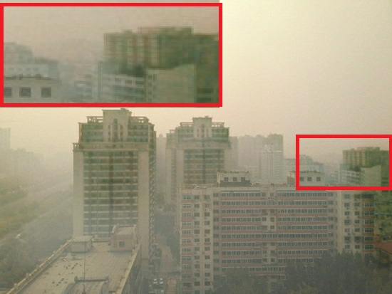

# Domain Randomization on Deep Learning Models for Image Dehazing [NCC - 2021]


## By Abdul Fathaah Shamsuddin, Abhijith P,  Krupasankari Ragunathan, Deepak Raja Sekar P M, Praveen Sankaran


## overview

This repository contains files used to create a domain randomized dehazing dataset in Unity 3D. It also contains a UNET model in which the data was trained on. This work was done as part of final year project for the completion of B.Tech in Electronics and Communication Engineering.
In this project we use domain randomization to generate a simulated dataset which was used to train a learning based model to give outstanding real-world dehazing performance.

## DRDehaze Dataset

The dataset that gave the best results can be found [here](https://www.kaggle.com/abdulfta/domain-randomized-dehazing-synthetic-data).

## Sample Results

<p align='center'>
 


</div>

<p align='center'>
 


</div>

## Citation

We request that the dataset be used for research purposes alone and referred to our following work
```
@INPROCEEDINGS{Sham2105:Domain,
AUTHOR="Abdul Fathaah Shamsuddin and Abhijith P and Deepak {Raja Sekar P M} and
Krupasankari Ragunathan and Praveen Sankaran",
TITLE="Domain Randomization on Deep Learning Models for Image Dehazing",
BOOKTITLE="2021 National Conference on Communications (NCC) (NCC 2021)",
ADDRESS="virtual, India",
DAYS=26,
MONTH=jul,
YEAR=2021
}
```

---
For queries contact [abdulfta12@gmail.com](abdulfta12@gmail.com).
